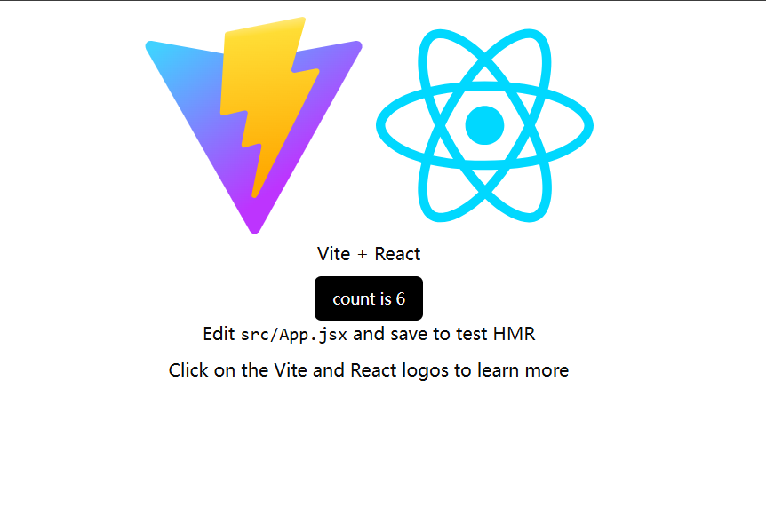

# React + Vite + Shadcn/ui

使用 `vite` 创建的 `react` + `shadcn/ui` 的 js 模板。

## devdependencies version

- vite 6.0.7
- react 18.3.1
- tailwindcss 3.4.17
- postcss 8.5.1
- autoprefixer 10.4.20
- shadcn 2.1.8

## create command

```sh
# 使用 vite 创建基础项目
pnpm create vite@latest

# 添加tailwindcss 依赖
pnpm add -D tailwindcss postcss autoprefixer

# 使用`tailwindcss cli`生成 tailwindcss 配置
pnpm dlx tailwindcss init -p

# ... 添加shadcn 的一些配置
# jsconffig.json jsconfig.app.json vite.config.js

# 根据刚刚的配置使用 shadcn cli 初始化shadcn (会生成`src/lib/utils.js`文件)
pnpm dlx shadcn@latest init

# 之后随时添加需要的组件(自行生成文件放到`src/components/ui`文件夹下)
pnpm dlx shadcn@latest add button

```

## preview


